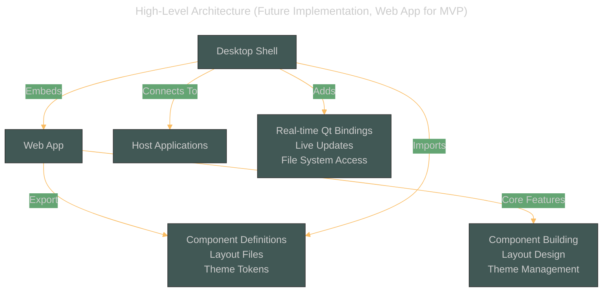
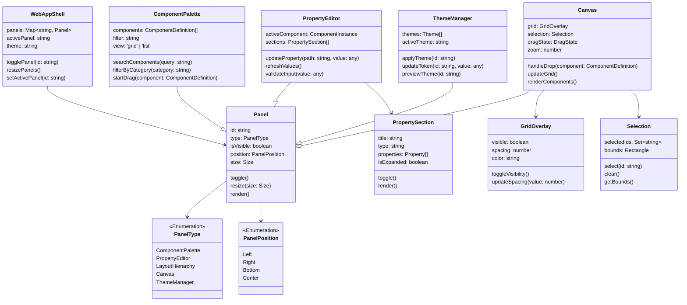
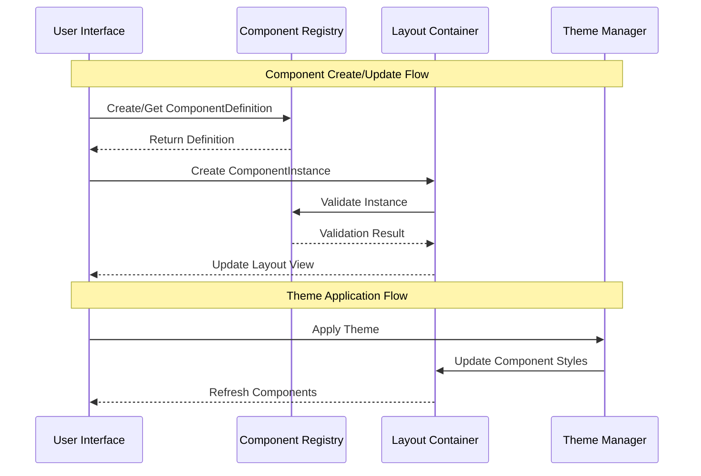
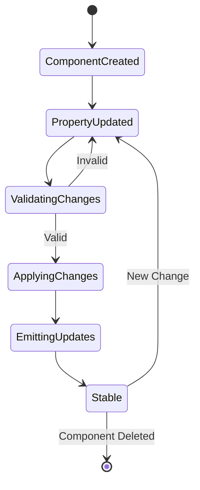

# OmniUI

## Overview

OmniUI is a visual development tool that allows users to create, customize, and manage UI components between desktop and web platforms. While initially focused on Qt, OmniUI is designed as a central platform for UI development that can adapt to multiple frameworks. The system will allow developers to create interfaces once and preview/export them to different UI libraries based on their specific capabilities and constraints, starting with Qt but architecturally ready to expand to other frameworks. This capstone project focuses on implementing the React-based component layout & visualization system though a web interface.

### Problem Space

Many desktop applications rely on Qt for their user interfaces due to its sophistication, maturity, and overall stability. While Qt provides robust functionality, organizations face significant challenges when trying to modernize their Qt applications:

-   Legacy Qt applications need modern UI capabilities but complete rewrites are too costly and risky
-   Qt's styling and layout capabilities remain limited compared to modern web frameworks
-   QML (Qt Quick) introduced modern features but has limitations when integrating with traditional Qt applications
-   QWebChannel offers a bridge to web technologies but comes with performance and integration constraints
-   Development tools for Qt UIs lack the rich features available in modern web development

This ~creates several practical challenges for Qt developers:

-   Modernizing interfaces while maintaining compatibility with existing Qt codebases
-   Creating responsive, modern UI components within Qt's constraints
-   Debugging and optimizing Qt UIs without modern development tools
-   Integrating web-based features into Qt applications cleanly

OmniUI directly addresses these Qt modernization challenges through a web-based development environment that bridges modern UI development with Qt applications. While the architecture is designed to be flexible for future expansion, the focus is on providing Qt developers with powerful tools to modernize their applications without complete rewrites.

### User Profile

Primary users will be developers and teams working with Qt-based applications who need to:

-   Modernize legacy Qt application interfaces
-   Maintain Qt compatibility while using modern UI approaches
-   Create consistent UI components across their Qt applications
-   Rapidly prototype and test UI components

#### _In particular, this tool serves:_

**Qt Application Developers...**

-   ... Maintaining established Qt codebases
-   Need to add modern UI components
-   Require performance optimization tools

**Plugin/Extension Developers...**

-   ... Creating add-ons for Qt-based applications
-   Need reliable integration patterns
-   Want to use modern web technologies

**UI/UX Teams...**

-   ... Collaborating with Qt developers
-   Need visual development tools
-   Want rapid prototyping capabilities
-   Require preview capabilities for Qt constraints

## Features

### Component Management

-   Create and manage atomic component instances from a component palette
-   Drag and drop interface for component placement
-   Define component properties using platform-agnostic interfaces
-   Select and modify component properties through visual editor
-   Delete or duplicate existing components
-   Hierarchical component organization (atoms -> molecules -> organisms)

### Layout Management

-   Grid-based layout system for precise component positioning
-   Visual resizing and positioning of components
-   Component grouping and nesting capabilities
-   Basic constraint system for layout management
-   Clean interface design for future platform adaptation

### Property Editor

-   Visual interface for component property editing
-   Real-time property updates
-   Type-safe property definitions
-   Property validation system
-   Clean property interface design for future platform support

### Theme System

-   Define and manage theme tokens (colors, spacing, typography)
-   Create and manage themes with platform-agnostic structure
-   Real-time theme preview in the editor
-   Theme token system designed for multi-platform export
-   Basic theme switching capabilities

### Development Tools

-   Basic component tree visualization
-   Simple state inspection tools
-   Real-time preview capabilities
-   Performance monitoring foundations
-   Platform Preview System
    -   Preview UI as it would appear in the target platform
    -   Real-time visualization of platform-specific constraints
    -   Side-by-side comparison views
    -   Visual indicators for unsupported features

## Implementation

For the capstone project, I will focus on implementing the Web Application as a UI development tool. It will include initial export capabilities if time allows.
The Desktop Integration Shell architecture is documented for future development but is out of scope for the initial implementation.

### Architecture Overview



### Tech Stack

#### Web Application (Capstone Focus)

-   React for UI with platform-agnostic core (components and layout)
-   TypeScript for type safety and interface definitions
-   Tailwind CSS
-   Jest + React Testing Library
-   Vite for build system
-   Client libraries:
    -   zustand (for extensible state management)
    -   immer (for immutable state updates)
    -   nanoid (for unique IDs)
    -   dnd-kit for drag and drop functionality
    -   Potentially react-virtualized or react-window for handling large component trees
-   FastAPI for API server (Migration to Django later if auth needs increase)
-   Pydantic for data validation and serialization

#### Desktop Integration Shell (Future Development)

-   Python/PySide2
-   QtWebEngine
-   WebChannel
-   C++ (for performance-critical components)

### MVP Component Types & Theme Token Structure

#### Components to Make

-   **Containers:** Panel, ScrollBox
-   **Controls:** Button, TextInput
-   **Display:** Label

#### Theme Token Structure

-   **Colors:**
    -   Primary
    -   Secondary
    -   Background
    -   Text
-   **Spacing:**
    -   Small
    -   Medium
    -   Large
-   **Typography:**
    -   Body:
        -   Font Size
        -   Line Height
        -   Font Family

### Sitemap

-   Main Editor (Layout/Component Canvas)
    -   Property Editor Panel
    -   Component Palette (Atoms/Molecules view)
    -   Layout Hierarchy Panel
    -   Theme Manager
    -   Widget Definitions Panel _(Future)_
    -   Connections/Events Panel _(Future)_
    -   Developer tools _(Future)_
-   Component Palette
    -   Available components
    -   Saved templates
    -   Component search
-   Export Center _(Future)_
    -   Layout export
    -   Theme export
    -   Configuration settings

### Mockups

![[Main Editor.png]]

![[Panel Overview.png]]

### Data

#### Component Class Structure:

```mermaid
classDiagram
    %%%%%%%%%%%%%%%%
    %% Base Classes
    %%%%%%%%%%%%%%%%

    class BaseDefinition {
        <<Abstract>>
        id: string // Unique identifier across the system
        name: string // Technical identifier used in code
    	label: string // Human-readable display name
        visible: boolean // appears in tools/registries
        enabled: boolean // whether can be used
        metadata: TrackingMetadata // track changes in library
    }

    BaseDefinition --> TrackingMetadata
    note for BaseDefinition "Base class for definitions that can be stored in registries"

    class BaseInstance["BaseDefinition for Instances"] {
        <<Abstract>>
        id: string // Unique instance identifier
        name: string // Optional user-assigned name
    	label: string // displayed text
        visible: boolean // UI visibility state
        enabled: boolean // UI enabled state
        metadata: TrackingMetadata // Track changes in layout
    }

    BaseInstance --> TrackingMetadata
    note for BaseInstance "Base class for component instances that live in layouts"

    class TrackingMetadata {
        <<Value>>
        createdAt: string
        updatedAt: string
        version: number

        isNewerThan(other: TrackingMetadata): boolean
        clone(): TrackingMetadata
    }

    %%%%%%%%%%%%%%%%%%%%%
    %% Widget Management
    %%%%%%%%%%%%%%%%%%%%%

    class Widget~BaseDefinition~ {
        rootContainer: LayoutContainer

        getComponent(id: string): ComponentDefinition|ComponentInstance
        exportState(): StateSnapshot
        importState(snapshot: StateSnapshot): void
    }

    Widget --> LayoutContainer
    Widget ..> StateSnapshot: to save state
    note for Widget "Represents a complete UI widget. Can contain multiple components and manages their state."

    %%%%%%%%%%%%%%%%%%%%%
    %% Component Sharing
    %%%%%%%%%%%%%%%%%%%%%

    class ComponentRegistry {
        <<Service>>
        components: Map~string, ComponentDefinition~

        register(component: ComponentDefinition)
        getComponent(id: string): ComponentDefinition
        validateDefinition(def: ComponentDefinition): boolean
    }

    ComponentRegistry --> ComponentDefinition
    note for ComponentRegistry "Manages component definitions and their relationships. Central registry for all component types in the system."

    %%%%%%%%%%%%%%%
    %% Basic State
    %%%%%%%%%%%%%%%

    class StateSnapshot {
        id: string
        components: Map~string, ComponentInstance~

        validate(): boolean
    }

    %%%%%%%%%%%%%%%%%%%
    %% Core Components
    %%%%%%%%%%%%%%%%%%%

    class ComponentDefinition~BaseDefinition~ {
        type: ComponentType
        isLayout: boolean
        children?: LayoutContainer
        config: ComponentConfig

        validate(): boolean
        clone(): ComponentDefinition
        getDefaultConfig(): ComponentConfig
    }

    ComponentDefinition --> ComponentType
    ComponentDefinition --> LayoutContainer
    ComponentDefinition --> ComponentConfig
    note for ComponentDefinition "Recursively structured when isLayout"

    class ComponentInstance~BaseDefinition~ {
        definitionId: string
        overrides: Map~string, ComponentConfig~

        updateFromSource(): void
        getPathForComponent(componentId: string): string
        setOverrideAtPath(path: string, changes: Partial~ComponentDefinition~): void
    }

    ComponentInstance ..> ComponentDefinition: definition from
    ComponentInstance --> ComponentConfig

    class ComponentConfig {
        content?: ContentConfig
        layout?: LayoutConfig
        style?: StyleConfig

        validate(): boolean
        clone(): ComponentConfig
        merge(other: ComponentConfig): ComponentConfig
    }

    ComponentConfig --> ContentConfig
    ComponentConfig --> LayoutConfig
    ComponentConfig --> StyleConfig
    note for ComponentConfig "Complete configuration for a component. Includes content, layout, and style settings."

    class ComponentType {
        <<Enumeration>>
        Panel, ScrollBox
        Button, TextInput
        Label
    }

    %%%%%%%%%%%%%%%%%
    %% Layout System
    %%%%%%%%%%%%%%%%%

    class LayoutConfig {
        <<Config>>
        position: Position
        size: Size

        validate(): boolean
    }

    LayoutConfig --> Position
    LayoutConfig --> Size

    class LayoutContainer {
        id: string
        grid?: GridConfig
        components: Map~string, ComponentDefinition|ComponentInstance~

        addComponent(component: ComponentInstance, position?: Position): void
        removeComponent(id: string): void
        moveComponent(id: string, newPosition: Position): void
        resizeComponent(id: string, newSize: Size): void
        validateLayout(): boolean
        findClosestGridPosition(point: Position): Position
    }

    LayoutContainer --> GridConfig
    %% ComponentDefinition has the connection here that is 2 ways
    note for LayoutContainer "Container for layout-based components. Handles grid-based positioning and component management."

    class GridConfig {
        <<Config>>
        rows: number
        columns: number
        cellSize: Distance
        gap?: Distance

        getCellPosition(row: number, col: number): Position
        getCellSize(): Size
        validate(): boolean
    }

    GridConfig --> Distance
    %% note for GridConfig "Grid-based layout configuration. Used by LayoutContainer for positioning components."

    class Position {
        <<Value>>
        x: Distance
        y: Distance

        clone(): Position
        add(other: Position): Position
        subtract(other: Position): Position
    }

    Position --> Distance

    class Size {
        <<Value>>
        width: Distance
        height: Distance

        clone(): Size
        fits(container: Size): boolean
    }

    Size --> Distance

    class Distance {
        <<Value>>
        length: number
        unit: UnitType

        toPixels(): number
        convertTo(unit: UnitType): Distance
    }

    Distance --> UnitType

    class UnitType {
        <<Enumeration>>
        Pixels, Percentage
    }

    %%%%%%%%%%%%%%%%%%%%%%%%%%
    %% Theme System & Styling
    %%%%%%%%%%%%%%%%%%%%%%%%%%

    class StyleConfig {
        <<Config>>
        classes: string[]
        overrides: Record~string, ThemeToken~

        validate(): boolean
    }

    StyleConfig --> ThemeToken

    class Theme~BaseDefinition~ {
        tokens: Map~string, ThemeToken~

        getEffectiveToken(id: string): ThemeToken
        validateTokens(): boolean
        applyTo(component: ComponentDefinition): void
    }

    Theme --> ThemeToken

    class ThemeToken {
        id: string
        type: TokenType
        value: string|number

        validate(): boolean
    }

    ThemeToken --> TokenType

    class TokenType {
        <<Enumeration>>
        Color, Number
        String
        %% Dimension later
    }

    %%%%%%%%%%%%%%%%%%%%%%%%%
    %% Content Configuration
    %%%%%%%%%%%%%%%%%%%%%%%%%

    class ContentConfig {
        <<Config>>
        inputType?: InputType
        format?: string
        value: any

        validate(): boolean
    }

    ContentConfig --> InputType

    class InputType {
        <<Enumeration>>
        Text, Number
        %% Color, Date, Select later
    }
```



#### Application UI Class Structure:



#### State Flow Diagrams





#### Storage Schemas

```typescript
// MVP LocalStorage Organization
interface LocalStorageStructure {
    // Component Storage
    ["omni-ui:components"]: {
        // Component Definitions (templates)
        definitions: {
            [id: string]: {
                id: string;
                name: string;
                type: "Panel" | "ScrollBox" | "Button" | "TextInput" | "Label";
                config: {
                    content?: {
                        inputType?: "Text" | "Number";
                        format?: string;
                        value: any;
                    };
                    layout?: {
                        position: {
                            x: number;
                            y: number;
                        };
                        size: {
                            width: number;
                            height: number;
                        };
                    };
                    style?: {
                        classes: string[];
                        overrides: Record<string, ThemeToken>;
                    };
                };
            };
        };

        // Component Instances (actual uses in layouts)
        instances: {
            [id: string]: {
                id: string;
                definitionId: string;
                overrides: {
                    content?: {
                        value: any;
                    };
                    layout?: {
                        position: {
                            x: number;
                            y: number;
                        };
                        size: {
                            width: number;
                            height: number;
                        };
                    };
                    style?: {
                        classes: string[];
                        overrides: Record<string, ThemeToken>;
                    };
                };
            };
        };
    };

    // Layout Storage
    ["omni-ui:layouts"]: {
        [id: string]: {
            id: string;
            grid?: {
                rows: number;
                columns: number;
                cellSize: {
                    width: number;
                    height: number;
                };
            };
            components: string[]; // Array of instance IDs
        };
        activeLayout: string;
    };

    // Basic Theme Data
    ["omni-ui:themes"]: {
        [id: string]: {
            id: string;
            name: string;
            tokens: {
                [id: string]: {
                    type: "Color" | "Number" | "String";
                    value: string | number;
                };
            };
        };
        activeTheme: string;
    };

    // UI State Storage
    ["omni-ui:ui-state"]: {
        selectedComponent: string | null;
        panelStates: {
            [panelId: string]: boolean; // visibility state of panels
        };
        gridSettings: {
            showGrid: boolean;
            snapToGrid: boolean;
            gridSize: number;
        };
    };
}

// Storage Keys for Type Safety
const STORAGE_KEYS = {
    COMPONENTS: "omni-ui:components",
    LAYOUTS: "omni-ui:layouts",
    THEMES: "omni-ui:themes",
    UI_STATE: "omni-ui:ui-state",
} as const;
```

### APIs

For the initial implementation, all API endpoints will be implemented using browser storage (localStorage) as the backend. While no external server will be required for the MVP, the API structure follows RESTful patterns to maintain consistency and allow for future server implementation. The endpoints found in the Endpoints section below define the core functionality.

### Endpoints

Implementation details:

-   All data (components, layouts, and themes) will be stored as JSON in localStorage
-   Default/template items will be included in the initial application state
-   The client-side implementation will mirror the API structure defined below
-   Each endpoint will be implemented as a service that interfaces with localStorage
    The following API structure defines how data will be organized and accessed:

#### Components & Templates

`GET /components/definitions`

-   **Parameters**:

    -   category (optional): Filter by 'atoms', 'molecules', or 'organisms'
    -   search (optional): Search by component name

-   **Response:** 200 OK

```json
[
    {
        "id": "button-1",
        "name": "Primary Button",
        "category": "atoms",
        "type": "button",
        "defaultProps": {
            "text": "Click me",
            "variant": "primary"
        }
    }
]
```

-   **Error Responses:**

    -   400 Bad Request: Invalid category parameter
    -   500 Internal Server Error

`GET /components/definitions/:id`

-   **Parameters:**

    -   id (required): Component definition identifier

-   **Response:** 200 OK

```json
{
    "id": "form-1",
    "name": "Login Form",
    "category": "organisms",
    "type": "composite",
    "defaultProps": {},
    "childComponents": []
}
```

-   **Error Responses:**

    -   404 Not Found: Component definition not found
    -   500 Internal Server Error

`POST /components/definitions`

-   **Parameters:** None

-   **Request Body:**

```json
{
    "name": "New Component",
    "category": "molecules",
    "type": "composite",
    "defaultProps": {},
    "childComponents": []
}
```

-   **Response:** 201 Created

```json
{
    "id": "comp-123",
    "name": "New Component",
    "created": "2024-01-18T12:00:00Z"
}
```

-   **Error Responses:**

    -   400 Bad Request: Invalid component data
    -   500 Internal Server Error

`PUT /components/definitions/:id`

-   **Parameters:**

    -   id (required): Component definition identifier

-   **Request Body:**

```json
{
    "name": "Updated Component",
    "defaultProps": {
        "newProp": "value"
    }
}
```

-   **Response:** 200 OK

```json
{
    "id": "comp-123",
    "name": "Updated Component",
    "updated": "2024-01-18T12:00:00Z"
}
```

-   **Error Responses:**

    -   400 Bad Request: Invalid component definition data
    -   404 Not Found: Component definition not found
    -   500 Internal Server Error

`DELETE /components/definitions/:id`

-   **Parameters:**

    -   id (required): Component definition identifier

-   **Response:** 204 No Content

-   **Error Responses:**

    -   404 Not Found: Component definition not found
    -   500 Internal Server Error

`GET /components/instances`

-   **Parameters:**

    -   layoutId (optional): Filter instances by layout identifier
    -   componentType (optional): Filter by component type
    -   parentId (optional): Get child instances of a specific component

-   **Response:** 200 OK

```json
{
    "instances": [
        {
            "id": "instance-1",
            "definitionId": "button-1",
            "position": {
                "x": 100,
                "y": 50
            },
            "size": {
                "width": 120,
                "height": 40
            },
            "overrides": {
                "properties": {
                    "text": "Custom Button",
                    "variant": "secondary"
                },
                "style": {
                    "backgroundColor": "#FF0000"
                }
            }
        }
    ]
}
```

-   **Error Response:**

    -   400 Bad Request: Invalid filter parameters
    -   404 Not Found: Layout or parent component not found
    -   500 Internal Server Error

`GET /components/instances/:id`

-   **Parameters:**

    -   id (required): Instance identifier

-   **Response:** 200 OK

```json
{
    "instance": {
        "id": "instance-1",
        "definitionId": "button-1",
        "position": {
            "x": 100,
            "y": 50
        },
        "size": {
            "width": 120,
            "height": 40
        },
        "overrides": {
            "properties": {
                "text": "Custom Button",
                "variant": "secondary"
            },
            "style": {
                "backgroundColor": "#FF0000"
            }
        },
        "computed": {
            "effectiveStyle": {
                "backgroundColor": "#FF0000",
                "padding": "8px",
                "borderRadius": "4px"
            },
            "inheritedProperties": {
                "fontFamily": "Inter",
                "fontSize": "14px"
            }
        }
    }
}
```

-   **Error Response:**

    -   404 Not Found: Component not found
    -   500 Internal Server Error

`POST /components/instances`

-   **Parameters:** None

-   **Request Body:**

```json
{
    "definitionId": "button-1",
    "layoutId": "layout-123",
    "position": {
        // Optional: Initial position
        "x": 100,
        "y": 50
    },
    "size": {
        // Optional: Initial size
        "width": 120,
        "height": 40
    },
    "overrides": {
        // Optional: Property overrides
        "properties": {
            "text": "New Button",
            "variant": "primary"
        },
        "style": {
            "backgroundColor": "#106B59"
        }
    }
}
```

-   **Response:** 201 Created

```json
{
    "id": "instance-123",
    "instance": {
        "id": "instance-123",
        "definitionId": "button-1",
        "position": {
            "x": 100,
            "y": 50
        },
        "size": {
            "width": 120,
            "height": 40
        },
        "overrides": {
            "properties": {
                "text": "New Button",
                "variant": "primary"
            },
            "style": {
                "backgroundColor": "#106B59"
            }
        }
    },
    "created": "2024-01-27T12:00:00Z"
}
```

-   **Error Response:**

    -   400 Bad Request: Invalid component data
    -   404 Not Found: Component definition or layout not found
    -   500 Internal Server Error

`PUT /components/instances/:id`

-   **Parameters:**

    -   id (required): Instance identifier

-   **Request Body:**

```json
{
    "position": {
        "x": 200,
        "y": 100
    },
    "size": {
        "width": 150,
        "height": 50
    },
    "overrides": {
        "properties": {
            "text": "Updated Button",
            "variant": "secondary"
        },
        "style": {
            "backgroundColor": "#415855"
        }
    }
}
```

-   **Response:** 200 OK

```json
{
    "id": "instance-123",
    "updated": "2024-01-27T12:00:00Z"
}
```

-   **Error Response:**

    -   400 Bad Request: Invalid instance data
    -   404 Not Found: Instance not found
    -   500 Internal Server Error

`DELETE /components/instances`

-   **Parameters:**

    -   id (required): Instance identifier

-   **Response:** 204 No Content

-   **Error Response:**

    -   404 Not Found: Instance not found
    -   500 Internal Server Error

`GET /components/layout`

-   **Parameters:**

    -   instanceId (required): Instance identifier to get layout information

-   **Response:** 200 OK

```json
{
    "layout": {
        "id": "layout-123",
        "gridConfig": {
            "rows": 12,
            "columns": 12,
            "cellSize": {
                "width": 50,
                "height": 50
            },
            "gap": {
                "horizontal": 8,
                "vertical": 8
            }
        },
        "constraints": {
            "rowSpan": 2,
            "colSpan": 3,
            "rowAlign": "start",
            "colAlign": "center",
            "margin": {
                "top": 8,
                "right": 8,
                "bottom": 8,
                "left": 8
            }
        }
    }
}
```

-   **Error Responses:**

    -   404 Not Found: Instance not found
    -   500 Internal Server Error

`PUT /components/layout/:instanceId`

-   **Parameters:**

    -   instanceId (required): Instance identifier

-   **Request Body:**

```json
{
    "position": {
        "x": 100,
        "y": 200
    },
    "size": {
        "width": 150,
        "height": 100
    },
    "constraints": {
        "rowSpan": 2,
        "colSpan": 3,
        "rowAlign": "start",
        "colAlign": "center"
    }
}
```

-   **Response:** 200 OK

```json
{
    "id": "instance-123",
    "updated": "2024-01-27T12:00:00Z"
}
```

-   **Error Responses:**

    -   400 Bad Request: Invalid layout data
    -   404 Not Found: Instance not found
    -   500 Internal Server Error

#### Layouts

`GET /layouts`

-   **Parameters:**

    -   page (optional): Page number for pagination
    -   limit (optional): Number of items per page
    -   search (optional): Search by layout name

-   **Response:** 200 OK

```json
{
    "layouts": [
        {
            "id": "layout-1",
            "name": "Dashboard Layout",
            "created": "2024-01-18T12:00:00Z",
            "lastModified": "2024-01-18T14:30:00Z"
        }
    ],
    "total": 10,
    "page": 1,
    "limit": 20
}
```

-   **Error Response:**

    -   400 Bad Request: Invalid pagination parameters
    -   500 Internal Server Error

`GET /layouts/:id`

-   **Parameters:**

    -   id (required): Layout identifier

-   **Response:** 200 OK

```json
{
    "id": "layout-1",
    "name": "Dashboard Layout",
    "components": [
        {
            "id": "btn-1",
            "type": "button",
            "properties": {
                "text": "Save"
            },
            "layout": {
                "x": 0,
                "y": 0,
                "width": 100,
                "height": 40
            },
            "children": []
        }
    ],
    "theme": {
        "id": "theme-1",
        "name": "Default"
    }
}
```

-   **Error Responses:**

    -   404 Not Found: Layout not found
    -   500 Internal Server Error

`POST /layouts`

-   **Parameters:** None

-   **Request Body:**

```json
{
    "name": "New Layout",
    "components": [],
    "theme": {
        "id": "theme-1"
    }
}
```

-   **Response:** 201 Created

```json
{
    "id": "layout-2",
    "name": "New Layout",
    "created": "2024-01-18T12:00:00Z"
}
```

-   **Error Responses:**

    -   400 Bad Request: Invalid layout data
    -   404 Not Found: Referenced theme not found
    -   500 Internal Server Error

`PUT /layouts/:id`

-   **Parameters:**

    -   id (required): Layout identifier

-   **Request Body:**

```json
{
    "name": "Updated Layout",
    "components": [],
    "theme": {
        "id": "theme-1"
    }
}
```

-   **Response:** 200 OK

```json
{
    "id": "layout-2",
    "updated": "2024-01-18T12:00:00Z"
}
```

-   **Error Responses:**

    -   400 Bad Request: Invalid layout data
    -   404 Not Found: Layout not found
    -   500 Internal Server Error

`DELETE /layouts/:id`

-   **Parameters:**

    -   id (required): Layout identifier

-   **Response:** 204 No Content

-   **Error Responses:**

    -   404 Not Found: Layout not found
    -   500 Internal Server Error

`GET /layouts/grid`

-   **Parameters:**

    -   layoutId (required): Layout identifier

-   **Response:** 200 OK

```json
{
    "grid": {
        "config": {
            "rows": 12,
            "columns": 12,
            "cellSize": {
                "width": 50,
                "height": 50
            },
            "gap": {
                "horizontal": 8,
                "vertical": 8
            }
        },
        "occupied": [
            {
                "position": { "row": 1, "col": 1 },
                "span": { "rows": 2, "cols": 3 },
                "instanceId": "instance-123"
            }
        ]
    }
}
```

-   **Error Responses:**

    -   404 Not Found: Layout not found
    -   500 Internal Server Error

`PUT /layouts/grid`

-   **Parameters:**

    -   layoutId (required): Layout identifier

-   **Request Body:**

```json
{
    "config": {
        "rows": 12,
        "columns": 12,
        "cellSize": {
            "width": 50,
            "height": 50
        },
        "gap": {
            "horizontal": 8,
            "vertical": 8
        }
    }
}
```

-   **Response:** 200 OK

```json
{
    "id": "layout-123",
    "updated": "2024-01-27T12:00:00Z"
}
```

-   **Error Responses:**

    -   400 Bad Request: Invalid grid configuration
    -   404 Not Found: Layout not found
    -   500 Internal Server Error

#### Themes

`GET /themes/tokens`

-   **Parameters:**

    -   themeId (required): Theme identifier

-   **Response:** 200 OK

```json
{
    "tokens": {
        "colors": {
            "primary": "#106B59",
            "secondary": "#415855",
            "background": "#FFFFFF"
        },
        "spacing": {
            "small": "8px",
            "medium": "16px",
            "large": "24px"
        },
        "typography": {
            "body": {
                "fontSize": "16px",
                "lineHeight": "24px",
                "fontFamily": "Inter"
            },
            "heading": {
                "fontSize": "24px",
                "lineHeight": "32px",
                "fontFamily": "Inter"
            }
        }
    }
}
```

-   **Error Responses:**

    -   404 Not Found: Theme not found
    -   500 Internal Server Error

`PUT /themes/tokens`

-   **Parameters:**

    -   themeId (required): Theme identifier

-   **Request Body:**

```json
{
    "tokens": {
        "colors": {
            "primary": "#106B59",
            "secondary": "#415855"
        },
        "spacing": {
            "small": "8px",
            "medium": "16px"
        }
    }
}
```

-   **Response:** 200 OK

```json
{
    "id": "theme-123",
    "updated": "2024-01-27T12:00:00Z"
}
```

-   **Error Responses:**

    -   400 Bad Request: Invalid token data
    -   404 Not Found: Theme not found
    -   500 Internal Server Error

# Roadmap

## Part-Time Period (Weeks 4-9, 10-15 hours/week)

### Weeks 4: Project Foundation & Architecture

**Tasks:**

-   Initialize React/TypeScript/Vite project
-   Set up Tailwind CSS configuration
-   Create core state management with zustand
-   Component Class Implementation:
    -   BaseDefinition and BaseInstance
    -   Initial ComponentConfig structure
-   UI Class Implementation:
    -   WebAppShell and Panel system
    -   Basic panel management
    -   Initial UI state structure
-   Set up local storage patterns

**Actual Progress:**

-   ✅ Initialized React/TypeScript/Vite project with correct configuration
-   ✅ Set up Tailwind CSS with custom utilities and theme configuration
-   ✅ Implemented zustand store structure with persistence
-   ✅ Created core type definitions and base interfaces
-   ✅ Established folder structure and code organization patterns

### Week 5: ~~Basic UI Web Shell & Component Registry~~ Component System Foundation

**Tasks:**

-   Create main application web shell and panels
-   Implement ComponentRegistry
-   Build basic ComponentDefinition system
-   Create initial atomic components (Panel, Button)
-   Set up basic drag and drop infrastructure
-   Add component instance creation

**Actual Progress:**

-   ✅ Created AbstractInteractiveBase component system
-   ✅ Implemented robust style system with compositions and presets
-   ✅ Built flexible icon system with size presets
-   ✅ Created base state management system
-   ✅ Established types and utilities for measurements and geometry

### Week 6: ~~Layout Engine Foundation~~ UI Component Development Part 1

**Tasks:**

-   Implement LayoutContainer
-   Create GridConfig and grid system
-   Build Position/Size management
-   Create component canvas
-   Add basic component placement
-   Implement grid visualization

**Actual Progress:**

-   ✅ Developed PushButton component with variants
-   ✅ Created Panel system with configurations
-   ✅ Implemented Drawer component with positioning
-   ✅ Built Modal system with customization
-   ✅ Added IconButton component with presets
-   ✅ Created ScrollBox component

### Week 7: ~~Property System & Basic Editing~~ UI Component Development Part 2

**Tasks:**

-   Create property panel
-   Implement basic property editors
-   Add component instance management
-   Build component palette UI
-   Add basic theme token structure
-   Implement component updates

**Actual Progress:**

-   ✅ Built Dropdown and DropdownSelect components
-   ✅ Implemented Tabs component with variants
-   ✅ Created ListView and ListItem components
-   ✅ Added SearchBar component
-   ✅ Implemented Initial store management hooks
-   ✅ Created theme system foundation

### Week 8: Core Builder Infrastructure

**Tasks:**

-   Finish building main panels for UI
-   Implement basic canvas with grid system
-   Add drag-and-drop infrastructure
-   Create basic component palette
-   Implement basic layout system

**Success Criteria:**

-   [ ] Canvas Implementation:
    -   Canvas renders with configurable dimensions
    -   Grid system displays and toggles correctly
    -   Grid snapping works at different sizes
    -   Canvas supports basic component placement
-   [ ] Drag and Drop:
    -   Components can be dragged from palette to canvas
    -   Items snap to grid when dropped
    -   Visual feedback during drag operations
    -   Basic positioning validation
-   [ ] Component Palette:
    -   Displays available component types
    -   Components grouped by category
    -   Basic search filtering works
    -   Components show preview/thumbnail
    -   Drag initiation from palette works
-   [ ] Basic Layout System:
    -   Components maintain position on canvas
    -   Basic collision detection
    -   Components can be selected
    -   Components show resize handles
    -   Layout persists between sessions

### Week 9: Layout Engine & Property Editor

**Tasks:**

-   Complete layout container implementation
-   Add component resizing/positioning
-   Implement property editor panel
-   Add basic state management for components

**Success Criteria:**

-   [ ] Layout Container:
    -   Components can be nested
    -   Parent-child relationships maintained
    -   Proper event bubbling
    -   Position calculations work correctly
-   [ ] Component Controls:
    -   Components can be resized
    -   Components can be moved after placement
    -   Multiple selection works
    -   Basic alignment tools work
-   [ ] Property Editor:
    -   Shows properties for selected component
    -   Properties update in real-time
    -   Supports different property types
    -   Shows component hierarchy
    -   Property changes persist
-   [ ] State Management:
    -   Component states update correctly
    -   State changes reflect in UI
    -   Basic undo/redo works
    -   State persists between sessions

## Full-Time Period (Weeks 10-11)

### Week 10: Enhancement & Essential Features

**Tasks:**

-   Add component nesting capabilities
-   Implement component search/filtering
-   Add basic theme support
-   Implement save/load functionality
-   Add basic preview mode

**Success Criteria:**

-   [ ] Component Nesting:
    -   Components can contain other components
    -   Nested components maintain proper state
    -   Parent-child selection works
    -   Nested components resize properly
-   [ ] Component Organization:
    -   Search works across all components
    -   Filter by component type works
    -   Recently used components tracked
    -   Component grouping works
-   [ ] Theme Support:
    -   Basic theme switching works
    -   Component styles update with theme
    -   Theme changes persist
    -   Custom theme values work
-   [ ] Save/Load:
    -   Layouts can be saved
    -   Layouts can be loaded
    -   Component state preserved
    -   Basic error handling works

### Week 11: Polish & Documentation

**Tasks:**

-   Bug fixes and performance optimization
-   Complete essential documentation
-   Add basic export functionality
-   Prepare demonstration scenarios
-   Create example layouts

**Success Criteria:**

-   [ ] Code Quality:
    -   No critical bugs
    -   Performance maintains 60fps
    -   Memory usage is stable
    -   Error handling is comprehensive
-   [ ] Documentation:
    -   Code documentation complete
    -   User guide written
    -   API documentation complete
    -   Example layouts documented
-   [ ] Export Function:
    -   Basic layout export works
    -   Component relationships preserved
    -   Style information exports correctly
    -   Export format is valid
-   [ ] Demo Ready:
    -   3+ example layouts created
    -   All core features demonstrable
    -   UI is polished
    -   Performance is stable

## Future Implementations

### Phase 1: Direct MVP Extensions

-   Component inspection tools
-   Light/dark theme switching
-   Advanced grid visualization
    -   Component boundaries
    -   Alignment guides
    -   Spacing indicators
-   Component template library
-   State inspection panel
-   Enhanced property editors
    -   Multi-select editing
    -   Property search
    -   Quick actions

### Phase 2: Creator Tools

-   Theme creator interface
-   Layout templates system
-   Custom component creation
-   Component composition tools
-   Advanced layout constraints
-   Visual debugging tools
-   Export system foundation

### Phase 3: Platform Integration

-   Qt-specific optimizations
-   Platform preview system
-   Platform-specific theme overrides
-   Component platform validation
-   Export configurations
-   Platform bridges
-   Integration testing tools

### Phase 4: Collaboration & Advanced Features

-   Real-time collaborative editing
-   User presence system
-   Comments and annotations
-   Version control for layouts
-   Component marketplace
-   Sharing system
-   Permission management

### Phase 5: Professional Tools

-   Memory usage monitoring
-   Component versioning
-   Advanced state management
-   Performance profiling
-   Plugin system
-   Advanced grid nesting
-   Layout constraints system
